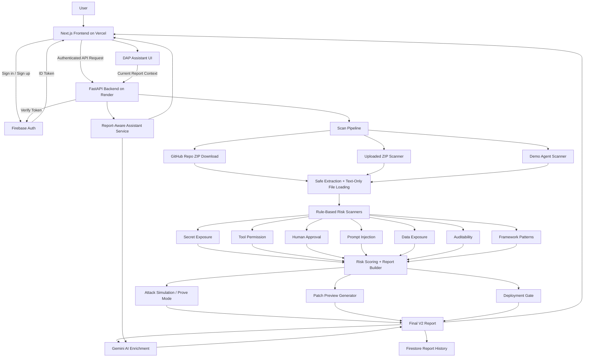
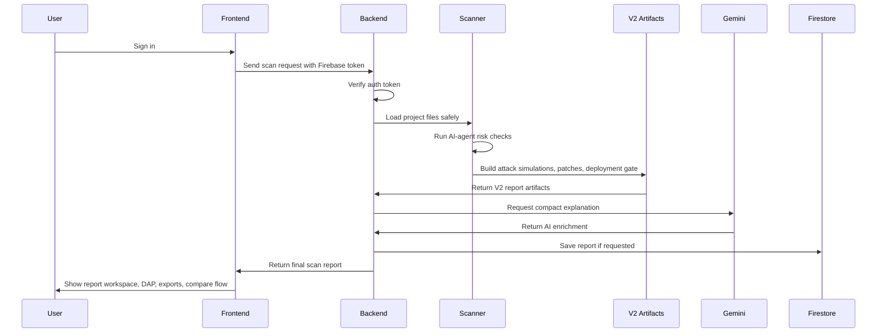

<div align="center">

# A-DAP-T

### AI-Agent Deployment Assessment and Protection Toolkit

**A deployment safety gate for GenAI and agentic application projects.**

A-DAP-T scans AI-agent repositories and uploaded projects for deployment risks such as exposed secrets, unsafe tool permissions, missing human approval gates, prompt-injection-prone workflows, weak auditability, and sensitive data exposure. V2 extends the scanner into a full **Scan → Prove → Patch → Compare → Gate** workflow.

<br/>

[](https://a-dap-t.vercel.app/)
[](https://adapt-3s27.onrender.com/docs)
[](https://a-dap-t.vercel.app/)
[](#ai-layer)
[](#authentication-and-report-history)

<br/>

<a href="https://a-dap-t.vercel.app/"><b>Open Live App</b></a>
&nbsp;&nbsp;•&nbsp;&nbsp;
<a href="https://www.youtube.com/watch?v=1r-QIjQmbbo"><b>Demo Video</b></a>

</div>

---

## Overview

Modern AI agents are no longer simple chat interfaces. They can call tools, query databases, access customer records, send emails, trigger refunds, read files, and perform workflow actions.

That creates a deployment problem: teams can often prove that an agent works, but they cannot always prove that the agent is safe enough to ship.

**A-DAP-T helps developers review AI-agent deployment risk before release.** It combines rule-based static scanning, agent-specific risk checks, safety scoring, attack simulation, patch previews, deployment gate output, saved report history, report comparison, Gemini-powered summaries, and a report-aware assistant called **DAP**.

---

## Product Workflow

```text
Scan → Prove → Patch → Compare → Gate
```

| Step | What A-DAP-T Does |
|---|---|
| Scan | Reads project files safely as text and runs AI-agent risk checks |
| Prove | Generates static attack simulations linked to actual findings |
| Patch | Creates developer-readable fix previews without auto-applying changes |
| Compare | Compares saved reports to show score deltas and risk reduction |
| Gate | Produces a BLOCK / REVIEW / ALLOW deployment decision and CI policy template |

A-DAP-T does **not** execute uploaded code and does **not** run active exploits against external systems.

---

## What A-DAP-T Detects

| Risk Area | What A-DAP-T Looks For |
|---|---|
| Prompt Injection Risk | Prompt files, unsafe user input handling, exposed system instructions |
| Secret Exposure Risk | Hardcoded API keys, tokens, credentials, suspicious config values |
| Tool Permission Risk | Risky tools such as email, refund, file, database, URL, and shell actions |
| Human Approval Risk | Sensitive actions without approval gates or confirmation checks |
| Data Exposure Risk | Sensitive records, customer data, PII-like fields, unmasked tool outputs |
| Auditability Risk | Missing logging around critical agent/tool actions |

---

## Core Features

- **Authenticated scanning flow**
  - Users sign in before running scans, saving reports, or using protected report actions.

- **Public GitHub repository scanning**
  - Paste a public GitHub repository URL and scan it directly.

- **ZIP upload scanning**
  - Upload project ZIP files with safe extraction limits and no code execution.

- **Built-in demo scans**
  - Compare a vulnerable support agent against a secured support agent.

- **AI-agent-specific scanner rules**
  - Detects LangChain, LangGraph, CrewAI, OpenAI-tool, Python, and JS/TS agent patterns.

- **Safety scoring**
  - Produces an overall safety score and category-level risk scores.

- **Prove Mode / Attack Simulations**
  - Shows static attack paths for detected findings, including malicious input, expected unsafe behavior, detection signal, and required guardrail.

- **Patch Previews**
  - Generates preview-only fixes for exposed secrets, missing approval gates, audit logging gaps, PII exposure, unsafe prompt handling, and tool scoping issues.

- **Deployment Gate**
  - Generates BLOCK / REVIEW / ALLOW decisions, policy JSON, GitHub Actions workflow template, blockers, next actions, and required CI secrets.

- **Report comparison**
  - Compares saved reports to show score movement, fixed findings, new findings, and category-level risk reduction.

- **Saved report history**
  - Authenticated users can reopen reports, delete reports, organize local report groups, and track score trends.

- **DAP assistant**
  - A report-aware assistant that answers questions using the current scan context, including V2 artifacts such as attack simulations, patches, and deployment gate output.

- **Exports**
  - Raw JSON export, browser PDF export, patch downloads, policy JSON download, and GitHub Actions workflow download.

---

## System Architecture



---

## Scan Workflow



---

## Tech Stack

| Layer | Technology |
|---|---|
| Frontend | Next.js 14 App Router, React, TypeScript, custom CSS |
| Backend | Python, FastAPI, Pydantic, Uvicorn |
| Authentication | Firebase Auth |
| Database | Firebase Firestore |
| AI Layer | Gemini, default model `gemini-2.5-flash` |
| Charts | Chart.js, react-chartjs-2 |
| Hosting | Vercel frontend, Render backend |
| Scanner Style | Rule-based static analysis + controlled V2 report artifacts |
| Export | Raw JSON, browser PDF, `.patch`, policy JSON, GitHub Actions YAML |

---

## Backend API

> Protected endpoints require `Authorization: Bearer <firebase_id_token>`.

| Method | Endpoint | Purpose |
|---|---|---|
| `GET` | `/health` | Backend health check |
| `POST` | `/auth/refresh` | Refresh Firebase ID tokens for active sessions |
| `GET` | `/scan/demo/vulnerable` | Scan the vulnerable demo support agent |
| `GET` | `/scan/demo/secured` | Scan the secured demo support agent |
| `POST` | `/scan/upload` | Scan an uploaded ZIP project |
| `POST` | `/scan/github` | Scan a public GitHub repository |
| `GET` | `/reports` | List saved reports for the current user |
| `GET` | `/reports/{report_id}` | Fetch one saved report |
| `DELETE` | `/reports/{report_id}` | Delete one saved report |
| `POST` | `/assistant/chat` | Ask DAP about the current scan report |
| `POST` | `/deployment-gate/evaluate` | Re-evaluate a report against a deployment gate policy |

---

## Expected Scan Response

A-DAP-T scan endpoints return a structured V2 report object:

```json
{
  "project_name": "vulnerable-support-agent",
  "scan_type": "demo_vulnerable",
  "safety_score": 32,
  "status": "High Risk",
  "summary": {
    "critical": 1,
    "high": 5,
    "medium": 4,
    "low": 0
  },
  "category_scores": {
    "prompt_injection": 15,
    "secret_exposure": 65,
    "tool_permission": 45,
    "human_approval": 25,
    "data_exposure": 65,
    "auditability": 45
  },
  "findings": [],
  "attack_simulations": [],
  "patches": [],
  "deployment_gate": {
    "decision": "BLOCK",
    "decision_badge": "Blocked before deployment",
    "minimum_safety_score": 75,
    "blockers": [],
    "github_actions_yaml": "name: A-DAP-T Agent Safety Gate...",
    "policy_json": "{...}"
  },
  "graph": {},
  "attack_replay": [],
  "remediation_checklist": [],
  "ai_summary": "Compact scan summary.",
  "ai_report_summary": "Short report-safe summary.",
  "ai_remediation_plan": [],
  "ai_next_steps": [],
  "ai_enrichment_status": "gemini_success",
  "saved_report": true,
  "report_id": "..."
}
```

---

## GitHub Repository Scanning

A-DAP-T can scan a public GitHub repository by URL.

Example request:

```json
{
  "repo_url": "https://github.com/Dhruvg334/closira-smb-support-agent",
  "branch": "main",
  "save_report": true
}
```

The backend validates the GitHub URL, downloads the repository ZIP, applies safe extraction limits, scans supported files as text, and returns a normal A-DAP-T scan report.

A-DAP-T does **not** execute repository code.

---

## ZIP Upload Safety Limits

Uploaded projects are handled conservatively:

- Maximum ZIP size: **20 MB**
- Maximum files: **300**
- Maximum nesting depth: **6**
- Maximum single file size: **500 KB**
- Files are read as text only
- Uploaded code is never executed
- Temporary files are cleaned after scanning

---

## AI Layer

A-DAP-T uses Gemini only after deterministic scanning and V2 artifact generation are complete.

Gemini helps generate:

- compact scan summary
- report-safe summary
- concise remediation plan
- concise next steps
- DAP assistant responses

Gemini does **not** decide:

- raw findings
- severity
- category scores
- safety score
- deployment status
- attack simulations
- patch logic
- deployment gate decision

The core detection remains rule-based and explainable.

---

## DAP Assistant

**DAP** is the report-aware assistant inside A-DAP-T.

It uses the current scan report as context and helps answer questions like:

- What should I fix first?
- Can this agent be deployed?
- Prove how this can be attacked.
- Which patch should I use?
- What does the deployment gate block?
- How can I improve the score?

DAP is intentionally scoped to report interpretation and remediation guidance. It is not a generic chatbot.

---

## Authentication and Report History

A-DAP-T uses Firebase Auth for account access.

Authenticated users can:

- run scans
- save reports
- view report history
- reopen previous reports
- delete saved reports
- organize local project groups
- compare saved reports
- ask DAP questions using report context

The frontend stores authenticated session metadata locally and refreshes Firebase ID tokens before protected API calls when needed. If refresh fails, the user is redirected back to sign in.

Firestore stores report history for each authenticated user.

---

## Local Setup

### 1. Clone the Repository

```bash
git clone <your-repository-url>
cd a-dap-t
```

### 2. Backend Setup

```bash
cd backend
python -m venv venv
venv\Scripts\activate
pip install -r requirements.txt
uvicorn main:app --reload
```

Backend runs at:

```text
http://127.0.0.1:8000
```

API docs:

```text
http://127.0.0.1:8000/docs
```

### 3. Frontend Setup

Open a second terminal:

```bash
cd frontend
npm install
npm run dev
```

Frontend runs at:

```text
http://localhost:3000
```

You can also run from the repository root:

```bash
npm run build
```

---

## Environment Variables

Create a local backend `.env` file for development.

```env
GEMINI_API_KEY=your_gemini_api_key_here
GEMINI_MODEL=gemini-2.5-flash

FIREBASE_PROJECT_ID=your_project_id
FIREBASE_CLIENT_EMAIL=your_service_account_email
FIREBASE_PRIVATE_KEY=your_private_key
```

The frontend reads the backend URL from:

```env
NEXT_PUBLIC_ADAPT_API_BASE=https://adapt-3s27.onrender.com
```

Do not commit real secrets.

---

## Project Structure

```text
a-dap-t/
├── backend/
│   ├── main.py
│   ├── requirements.txt
│   ├── .env.example
│   ├── app/
│   │   ├── ai/
│   │   ├── attack_simulator/
│   │   ├── deployment_gate/
│   │   ├── github/
│   │   ├── patches/
│   │   ├── scanners/
│   │   ├── schemas/
│   │   ├── security_assistant/
│   │   ├── services/
│   │   └── utils/
│   ├── scripts/
│   └── tests/
│
├── frontend/
│   ├── app/
│   │   ├── about/
│   │   ├── compare/
│   │   ├── methodology/
│   │   ├── profile/
│   │   ├── report/current/
│   │   ├── scanner/
│   │   ├── signin/
│   │   └── signup/
│   ├── components/
│   ├── lib/
│   ├── public/
│   └── types/
│
├── sample_agents/
│   ├── vulnerable-support-agent/
│   └── secured-support-agent/
│
└── docs/
    ├── A-DAP-T-V2-API-CONTRACT.md
    ├── V2_FRONTEND_HANDOFF.md
    ├── LIMITATIONS.md
    ├── SCORING_METHODOLOGY.md
    └── THREAT_MODEL.md
```

---

## What Makes It Different

Most scanners look for generic code security issues. A-DAP-T focuses on **AI-agent deployment behavior**:

- Can the agent call a risky tool?
- Is a human approval gate missing?
- Can a risky path be explained as a static attack simulation?
- Are sensitive records passed into the agent?
- Are system prompts exposed?
- Are agent actions logged?
- Are tool permissions too broad?
- Can developers get patch previews instead of only warnings?
- Can the repo be blocked before deployment through a gate policy?

That makes A-DAP-T more focused than a normal repository scanner and more practical than a generic chatbot demo.

---

## Limitations

A-DAP-T is an early risk visibility and deployment-safety tool.

It does not:

- execute uploaded projects
- auto-apply generated patches
- replace a professional security audit
- detect every possible vulnerability
- fully validate runtime behavior
- guarantee that an AI agent is safe for production

It is designed to help developers catch common AI-agent deployment risks earlier.

---

<div align="center">

**A-DAP-T helps teams move from prototype to deployment with clearer AI-agent risk visibility.**

</div>
